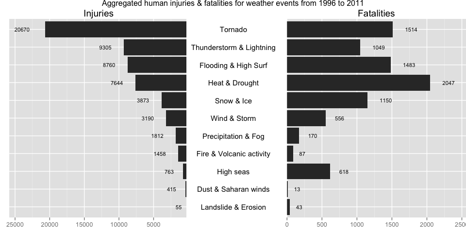
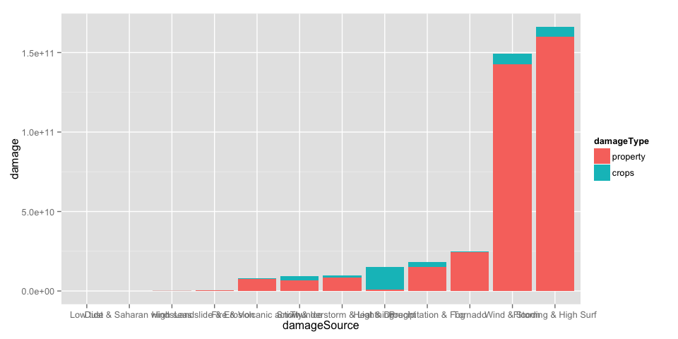

# [Title]
## Reproducible Research: Peer Assessment 2

### 1. Assignment

The basic goal of this assignment is to explore the NOAA Storm Database and answer some basic questions about severe weather events. You must use the database to answer the questions below and show the code for your entire analysis. Your analysis can consist of tables, figures, or other summaries. You may use any R package you want to support your analysis.

### 2. Synopsis

[Synopsis]

### 3. Data Processing


##### 3.1. Load libraries

```r
library(RCurl) # for loading external dataset (getBinaryURL)
library(R.utils) # for bunzip2

library(scales) 
library(Hmisc) 
library(plyr) # for count & aggregate method
library(reshape2) # for melt 

library(ggplot2) # for plots
library(grid) # for grids
library(gridExtra) # for advanced plots
```


##### 3.2. Load source file and extract it

```r
dataProcess <- TRUE
# check if reducedStormData variable already exists
if(file.exists("./data/StormData.RData")){
  load("./data/StormData.RData")
  dataProcess <- FALSE
}

if(dataProcess){
  # create a data dir if it doesn't exist
  if(!file.exists("./data")){
      dir.create("./data")
  }
  # load file from URL to bz2 file in data dir
  if(!file.exists("./data/StormData.csv.bz2")){
    fileUrl <- "https://d396qusza40orc.cloudfront.net/repdata/data/StormData.csv.bz2"
    destPath <- "./data/StormData.csv.bz2"
    binData <- getBinaryURL(fileUrl, ssl.verifypeer=0L, followlocation=1L)
    destFileHandle <- file(destPath, open="wb")
    writeBin(binData,destFileHandle)
    close(destFileHandle)
  }
  # unzip bz2 file to csv
  if(!file.exists("./data/StormData.csv")){
    filePath <- "./data/StormData.csv.bz2"
    destPath <- "./data/StormData.csv"
    bunzip2(filePath,destPath,overwrite=TRUE, remove=FALSE)
  }
}
```


##### 3.3. Load the data

```r
if(dataProcess){
  csvStormData <- read.csv("./data/StormData.csv")
}
```

##### 3.4. Remove unwanted colums (not used for this analysis)

```r
if(dataProcess){
  neededColumns <- c("BGN_DATE", "EVTYPE", "FATALITIES", "INJURIES", "PROPDMG", "PROPDMGEXP", "CROPDMG", "CROPDMGEXP")
  reducedStormData <- csvStormData[, neededColumns]
  reducedStormData <- rename(reducedStormData, c("FATALITIES"="fatalities", "INJURIES"="injuries"))
}
```

##### 3.5. Refactor BGN_DATE, determine the offset year to use, and reduce the dataset
Since the later years account for more observations, results could be skewed by the first years.
By still using the majority of the observations, the cutoff point is arbritrarely set at 75%

```r
if(dataProcess){
  # get some counts
  totalNumberOfObservations <- nrow(reducedStormData)
  cutOffPercentage = 0.75
  cutOffObservations = round(totalNumberOfObservations * cutOffPercentage)
  
  # add columns for date calculations based on BGN_DATEro
  reducedStormData$year = as.numeric(format(as.Date(reducedStormData$BGN_DATE, format = "%m/%d/%Y"), "%Y"))
  
  # create dataset with count per year, reverse the recordset, create running total 
  yearRecords <- count(reducedStormData, "year")
  yearRecords <- yearRecords[order(yearRecords$year, decreasing=TRUE), ]
  yearRecords$runningTotal = cumsum(yearRecords$freq)
  cutOffYear <- min(yearRecords[yearRecords$runningTotal < cutOffObservations, 1])
  
  # reduce the dataset
  reducedStormData <- reducedStormData[reducedStormData$year >= cutOffYear, ]
  endYear <- max(reducedStormData$year)
  
  # clean reducedStormData
  reducedStormData$BGN_DATE <- NULL
  rownames(reducedStormData) <- NULL
}
```

##### 3.6. Refactor EVTYPE into 12 levels
The EVTYPE contains ca. 985 unique source events. Many of them can be reduced to similar instances. In this instance there are 12 levels defined.

```r
if(dataProcess){
  reducedStormData$damageSource <- NA
  
  reducedStormData[grepl("precipitation|rain|hail|drizzle|wet|percip|burst|depression|fog|wall cloud", 
                         reducedStormData$EVTYPE, ignore.case = TRUE), "damageSource"] <- "Precipitation & Fog"
  reducedStormData[grepl("wind|storm|wnd|hurricane|typhoon", 
                         reducedStormData$EVTYPE, ignore.case = TRUE), "damageSource"] <- "Wind & Storm"
  reducedStormData[grepl("slide|erosion|slump", 
                         reducedStormData$EVTYPE, ignore.case = TRUE), "damageSource"] <- "Landslide & Erosion"
  reducedStormData[grepl("warmth|warm|heat|dry|hot|drought|thermia|temperature record|record temperature|record high", 
                         reducedStormData$EVTYPE, ignore.case = TRUE), "damageSource"] <- "Heat & Drought"
  reducedStormData[grepl("cold|cool|ice|icy|frost|freeze|snow|winter|wintry|wintery|blizzard|chill|freezing|avalanche|glaze|sleet", 
                         reducedStormData$EVTYPE, ignore.case = TRUE), "damageSource"] <- "Snow & Ice"
  reducedStormData[grepl("flood|surf|blow-out|swells|fld|dam break", 
                         reducedStormData$EVTYPE, ignore.case = TRUE), "damageSource"] <- "Flooding & High Surf"
  reducedStormData[grepl("seas|high water|high tide|tsunami|wave|current|marine|drowning", 
                         reducedStormData$EVTYPE, ignore.case = TRUE), "damageSource"] <- "High seas"
  reducedStormData[grepl("dust|saharan", 
                         reducedStormData$EVTYPE, ignore.case = TRUE), "damageSource"] <- "Dust & Saharan winds"
  reducedStormData[grepl("low tide", 
                         reducedStormData$EVTYPE, ignore.case = TRUE), "damageSource"] <- "Low tide"
  reducedStormData[grepl("tstm|thunderstorm|lightning", 
                         reducedStormData$EVTYPE, ignore.case = TRUE), "damageSource"] <- "Thunderstorm & Lightning"
  reducedStormData[grepl("tornado|spout|funnel|whirlwind", 
                         reducedStormData$EVTYPE, ignore.case = TRUE), "damageSource"] <- "Tornado"
  reducedStormData[grepl("fire|smoke|volcanic", 
                         reducedStormData$EVTYPE, ignore.case = TRUE), "damageSource"] <- "Fire & Volcanic activity"
  
  # remove uncategorized records (damageSource == NA) & cast as factor
  reducedStormData <- reducedStormData[complete.cases(reducedStormData[, "damageSource"]), ]
  reducedStormData$damageSource <- as.factor(reducedStormData$damageSource)
  
  # clean reducedStormData
  reducedStormData$EVTYPE <- NULL
}
```

##### 3.7. Refactor PROPDMG, CROPDMG, PROPDMGEXP & CROPDMGEXP to absolute damage values

```r
if(dataProcess){
  # function to convert symbol to a power of 10 (for use with PROPDMGEXP & CROPDMGEXP)
  toTenPower <- function(x){
    if(is.numeric(x)) {
      x <- x
    }
    else if(grepl("h", x, ignore.case=TRUE)) {
      x <- 2
    }
    else if(grepl("k", x, ignore.case=TRUE)) {
      x <- 3
    }
    else if(grepl("m", x, ignore.case=TRUE)) {
      x <- 6
    }
    else if(grepl("b", x, ignore.case=TRUE)) {
      x <- 9
    }
    else if(x == "" || x == " "){
      x <- 0
    }
    else{
      x <- NA
    }
    x
  }
   
  # function to take two parameters num and exp and convert it to one absolute value. non integers become 0
  calculateAmount <- function(num, exp){
    pow <- toTenPower(exp)
    if(is.numeric(num)){
      num <- num * (10 ^ pow)
    }
    
    if(!is.numeric(num)){
      num <- 0
    }
    
    num
  }
  
  # create 2 new fields for calculated propDamage & cropDamage and add them to one damageTotal field
  reducedStormData$propDamage <- mapply(calculateAmount, reducedStormData$PROPDMG, reducedStormData$PROPDMGEXP)
  reducedStormData$cropDamage <- mapply(calculateAmount, reducedStormData$CROPDMG, reducedStormData$CROPDMGEXP)
  reducedStormData$damageTotal = reducedStormData$propDamage + reducedStormData$cropDamage
  
  # clean reducedStormData
  reducedStormData$PROPDMG <- NULL
  reducedStormData$PROPDMGEXP <- NULL
  reducedStormData$CROPDMG <- NULL
  reducedStormData$CROPDMGEXP <- NULL
}
```

##### 3.8. Create aggregated datasets

```r
if(dataProcess){
  aggregatedStormDataEconomicDamage <- aggregate(formula=cbind(propDamage, cropDamage, damageTotal) ~ damageSource, data=reducedStormData, FUN=sum, na.rm=TRUE)
  aggregatedStormDataEconomicDamage <- aggregatedStormDataEconomicDamage[order(aggregatedStormDataEconomicDamage$damageTotal, decreasing=TRUE),]
  rownames(aggregatedStormDataEconomicDamage) <- NULL
  aggregatedStormDataEconomicDamage$damageSource <- factor(aggregatedStormDataEconomicDamage$damageSource, levels=rev(aggregatedStormDataEconomicDamage$damageSource))
  
  aggregatedMeltedStormDataEconomicDamage <- melt(aggregatedStormDataEconomicDamage, id.vars=c("damageSource"), measure.vars=c("propDamage","cropDamage"), variable.name="damageType", value.name="damage")
  levels(aggregatedMeltedStormDataEconomicDamage$damageType)[levels(aggregatedMeltedStormDataEconomicDamage$damageType)=="propDamage"] <- "property"
   levels(aggregatedMeltedStormDataEconomicDamage$damageType)[levels(aggregatedMeltedStormDataEconomicDamage$damageType)=="cropDamage"] <- "crops"
  
  aggregatedStormDataHumanDamage <-aggregate(formula=cbind(injuries, fatalities) ~ damageSource, data=reducedStormData, FUN=sum, na.rm=TRUE) 
  aggregatedStormDataHumanDamage <- aggregatedStormDataHumanDamage[order(aggregatedStormDataHumanDamage$injuries, decreasing=TRUE),]
  rownames(aggregatedStormDataHumanDamage) <- NULL
  aggregatedStormDataHumanDamage$damageSource <- factor(aggregatedStormDataHumanDamage$damageSource, levels=rev(aggregatedStormDataHumanDamage$damageSource))
  
  maxInjuries <- max(aggregatedStormDataHumanDamage$injuries)
  maxInjuries <- maxInjuries + round(maxInjuries * 0.25)
 
  maxFatalities <- max(aggregatedStormDataHumanDamage$fatalities)
  maxFatalities <- maxFatalities + round(maxFatalities * 0.25)
  
}
```

##### 3.10. Save reducedStormData to RData file 

```r
if(dataProcess){
  save(reducedStormData, 
       aggregatedStormDataHumanDamage, 
       aggregatedMeltedStormDataEconomicDamage,
       aggregatedStormDataEconomicDamage, 
       maxInjuries, 
       maxFatalities,
       cutOffYear,
       endYear,
       file="./data/StormData.RData")
}
```


### 4. Results
##### 4.1. Show the first 10 lines of the new data set

```r
head(reducedStormData, n=10L)
```

```
##    fatalities injuries year             damageSource propDamage cropDamage
## 1           0        0 1996               Snow & Ice     380000      38000
## 2           0        0 1996                  Tornado     100000          0
## 3           0        0 1996 Thunderstorm & Lightning       3000          0
## 4           0        0 1996 Thunderstorm & Lightning       5000          0
## 5           0        0 1996 Thunderstorm & Lightning       2000          0
## 6           0        0 1996      Precipitation & Fog          0          0
## 7           0        0 1996             Wind & Storm     400000          0
## 8           0        0 1996 Thunderstorm & Lightning      12000          0
## 9           0        0 1996 Thunderstorm & Lightning       8000          0
## 10          0        0 1996 Thunderstorm & Lightning      12000          0
##    damageTotal
## 1       418000
## 2       100000
## 3         3000
## 4         5000
## 5         2000
## 6            0
## 7       400000
## 8        12000
## 9         8000
## 10       12000
```

##### 4.2. Injuries vs. Fatalities

```r
# add middle column with just damageSource labels
g.mid <- ggplot(data=aggregatedStormDataHumanDamage, aes(x=1,y=damageSource)) +
            geom_text(aes(label=damageSource), size=4) +
            ggtitle("") +
            ylab(NULL) +
            scale_x_continuous(expand=c(0,0),limits=c(0.94,1.065)) +
            theme(axis.title=element_blank(),
                  panel.grid=element_blank(),
                  axis.text.y=element_blank(),
                  axis.ticks.y=element_blank(),
                  panel.background=element_blank(),
                  axis.text.x=element_text(color=NA),
                  axis.ticks.x=element_line(color=NA),
                  plot.margin = unit(c(1,-1,1,-1), "mm"))

# add left chart with injuries
g.injuries <- ggplot(data=aggregatedStormDataHumanDamage, aes(x=damageSource, y=injuries)) +
            geom_bar(stat = "identity") + 
            geom_text(aes(label=injuries), size=3, vjust=0.5, hjust=2.0) +
            ggtitle("Injuries") +
            scale_y_reverse(expand=c(0, 0), limits=c(maxInjuries,0)) + 
            coord_flip() +
            theme(axis.title.x = element_blank(), 
                  axis.title.y = element_blank(), 
                  axis.text.y = element_blank(), 
                  axis.ticks.y = element_blank(), 
                  plot.margin = unit(c(1,-1,1,0), "mm")) 

# add right chart with fatalities
g.fatalities <- ggplot(data=aggregatedStormDataHumanDamage, aes(x=damageSource, y=fatalities)) +
            geom_bar(stat = "identity") + 
            geom_text(aes(label=fatalities), size=3, vjust=0.5, hjust=-1.0) +
            ggtitle("Fatalities") +
            scale_y_continuous(expand=c(0, 0), limits=c(0,maxFatalities)) + 
            coord_flip() +
            theme(axis.title.x = element_blank(), 
                  axis.title.y = element_blank(), 
                  axis.text.y = element_blank(), 
                  axis.ticks.y = element_blank(), 
                  plot.margin = unit(c(1,0,1,-1), "mm")) 

# combine charts in one plot
gg.injuries <- ggplot_gtable(ggplot_build(g.injuries))
gg.fatalities <- ggplot_gtable(ggplot_build(g.fatalities))
gg.mid <- ggplot_gtable(ggplot_build(g.mid))

grid.arrange(gg.injuries,gg.mid,gg.fatalities,
             ncol=3,widths=c(4/10,2/10,4/10),
             main=paste("Aggregated human injuries & fatalities for weather events from ",cutOffYear," to ",endYear, sep=""))
```

 

##### 4.3. Economic Damage

```r
ggplot(aggregatedMeltedStormDataEconomicDamage, aes(x=damageSource, y=damage)) + 
geom_bar(stat = "identity", aes(fill=damageType)) 
```

 

